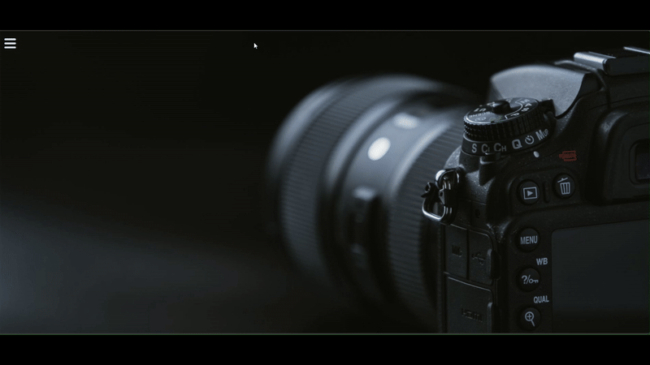

# First Sidebar Project

This is a simple sidebar menu built using **HTML** and **CSS**. It was created as part of my frontend learning journey to practice basic layout, positioning, and CSS transitions.

## 📌 Features

- Responsive sidebar layout
- Toggle menu using a checkbox (no JavaScript)
- Smooth hover and transition effects
- Social media icons included
- Beginner-friendly HTML and CSS code

## 🛠️ Technologies Used

- HTML5
- CSS3

## 🎥 Demo

## 📁 How to Use

1. Clone or download this repository.
2. Open `index.html` in your browser.
3. You will see the sidebar menu in action.

## 🧠 What I Learned

- CSS positioning (absolute, fixed)
- Styling sidebar layouts
- Using checkbox to toggle elements
- Building a UI without JavaScript

